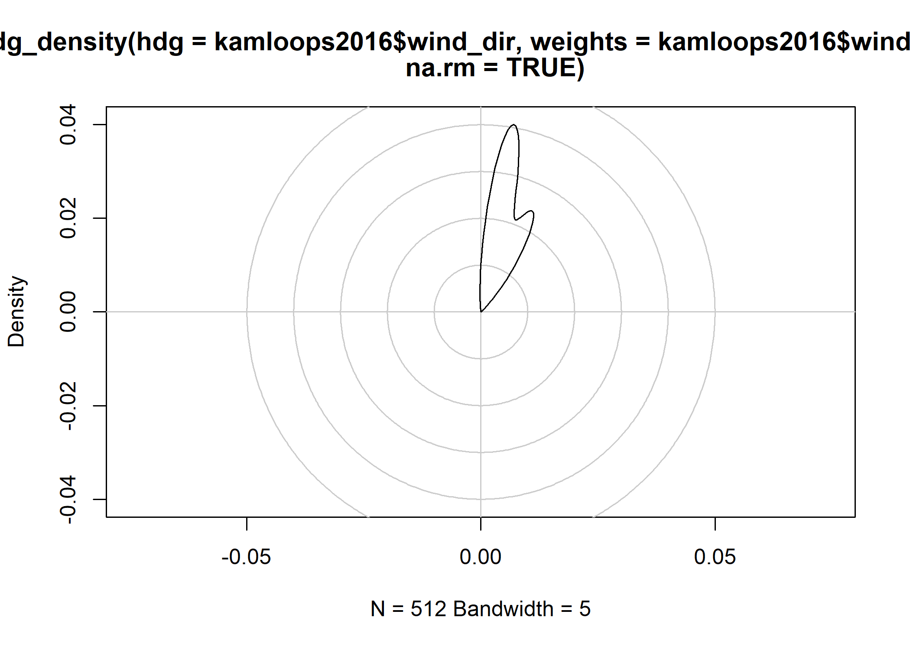
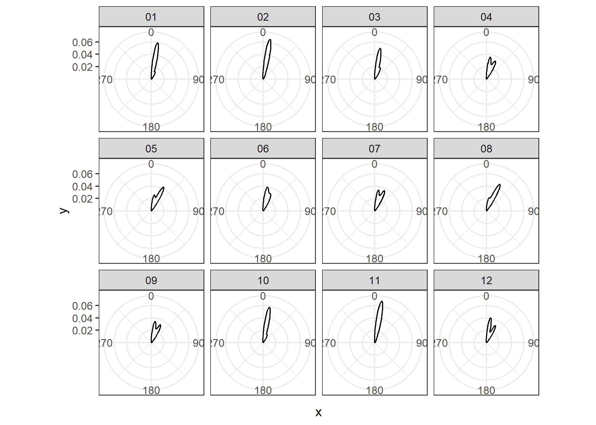

<!-- README.md is generated from README.Rmd. Please edit that file -->

# headings

<!-- badges: start -->

[](https://github.com/paleolimbot/headings/actions)
[](https://codecov.io/gh/paleolimbot/headings?branch=master)
[](https://lifecycle.r-lib.org/articles/stages.html#experimental)
<!-- badges: end -->

The goal of headings is to provide well-tested functions for working
with orientation data (headings), including aggregation (e.g., mean, sd)
and correction (e.g., declination).

## Installation

You can install the development version from
[GitHub](https://github.com/) with:

``` r
# install.packages("devtools")
devtools::install_github("paleolimbot/headings")
```

## Example

The headings package can calculate a proper mean and standard deviation
of compass headings:

``` r
library(headings)

# totally bogus since 0 and 360 are identical!
mean(c(350, 355, 360, 0, 5, 10))
#> [1] 180
sd(c(350, 355, 360, 0, 5, 10))
#> [1] 191.7551

# everybody wins!
hdg_mean(c(350, 355, 360, 0, 5, 10))
#> [1] 0
hdg_sd(c(350, 355, 360, 0, 5, 10))
#> [1] 7.071068
```

Functions to correct for magnetic declination are also provided for the
[IGRF13](https://www.ngdc.noaa.gov/IAGA/vmod/home.html),
[WMM2020](https://www.ngdc.noaa.gov/geomag/EMM/index.html), and
[EMM2017](https://www.ngdc.noaa.gov/geomag/WMM/DoDWMM.shtml) models.

``` r
hdg_decl(-64, 45, year = 2021)
#> [1] -16.88586
hdg_true_from_magnetic(13.40, -64, 45, year = 2021)
#> [1] 356.5141
hdg_magnetic_from_true(356.51, -64, 45, year = 2021)
#> [1] 13.39586
```

As an example, heading aggregation can be used to summarize climate
and/or current directions over time.

``` r
library(tidyverse)
library(weathercan)

# get some climate data
kam <- weathercan::weather_dl(
  station_ids = 51423,
  start = "2016-01-01",
  end = "2016-12-31"
)
#> As of weathercan v0.3.0 time display is either local time or UTC
#> See Details under ?weather_dl for more information.
#> This message is shown once per session

kam %>% 
  group_by(month) %>% 
  summarise(
    mean_wtd = hdg_mean(wind_dir, weights = wind_spd, na.rm = TRUE),
    sd_wtd = hdg_sd(wind_dir, weights = wind_spd, na.rm = TRUE)
  )
#> `summarise()` ungrouping output (override with `.groups` argument)
#> # A tibble: 12 x 3
#>    month mean_wtd sd_wtd
#>    <chr>    <dbl>  <dbl>
#>  1 01        13.5   7.80
#>  2 02        11.9   6.04
#>  3 03        15.0   8.09
#>  4 04        18.1   9.01
#>  5 05        20.5   8.87
#>  6 06        16.8   8.38
#>  7 07        18.4   8.72
#>  8 08        21.8   8.29
#>  9 09        18.6   9.47
#> 10 10        13.7   7.52
#> 11 11        11.0   5.25
#> 12 12        17.5   9.60
```

The headings package also comes with a circle-aware kernel density
function for visualizing vectors of headings.

``` r
plot(
  hdg_density(
    kam$wind_dir, 
    weights = kam$wind_spd, 
    na.rm = TRUE
  )
)
```



To use in ggplot2, you will need to extract the values from the density
output:

``` r
kam %>% 
  group_by(month) %>% 
  summarise(
    broom::tidy(hdg_density(wind_dir, weights = wind_spd))
  ) %>% 
  ggplot(aes(x, y)) +
  geom_line() +
  coord_polar() +
  scale_x_continuous(breaks = seq(0, 360, by = 90)) +
  facet_wrap(vars(month)) +
  theme_bw()
#> `summarise()` regrouping output by 'month' (override with `.groups` argument)
```


